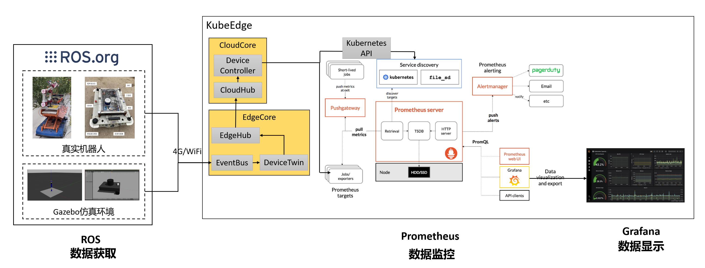

# 构建面向机器人的智能监控系统

## 项目背景

随着机器人技术和云计算技术的不断发展，研究人员希望将这两种技术结合起来，于是在2010年James Kuffer教授首次提出了云机器人这一概念。云机器人可以看作云端和机器人端的组合，可以实现对机器人实时监控和调度管理，可以在很大程度上的提升机器人的性能。

在机器人运行过程中，机器人的运行状态每时每刻都在变化，对机器人的运行状态进行监控，一方面可以方便操作人员对机器人进行调度，通过分发不同的任务使不同机器人的性能都发挥到最佳。另一方面，当机器人运行出现异常时，操作人员可以及时进行维修和保养。因此开发一个面向机器人的智能监控系统十分必要。

KubeEdge SIG Robotics基于KubeEdge，专注于云机器人领域，将云计算技术与机器人技术集成到一起，特别是基于云边缘协作架构的机器人管理系统，赋能现有机器人生态系统。基于边缘云协同架构，提高了机器人智能化程度和开发效率。具体来说，KubeEdge SIG Robotics支持异构机器人，包括移动机器人、机械臂等众多机器人平台。可以与其他开源社区合作，例如ROS，Gazebo，也可以与其他SIG合作，如SIG AI和SIG IoT。使机器人的开发、调试、模拟、部署和管理更加轻松。

但目前KubeEdge SIG Robotics缺乏面向机器人的可视化监控功能，因此本项目将基于KubeEdge、prometheus、grafana等开源组件，在KubeEdge SIG Robotics提供的机器人虚拟机仿真环境中开发一种面向机器人的可视化智能监控系统，为机器人开发者和用户提供一个可参考的案例。
##目标
对于机器人智能监控系统的开发者和使用用户来说，本项目的目标是为开发者和用户提供一个在基于KubeEdge SIG Robotics进行机器人开发过程中可参考的实践案例，主要包括：

- 端到端的测试用例（监控指标完成20+、美观界面、监控时延小于3s）
- 系统的部署和使用手册

## 提案

### 项目范围

扩展KubeEdge SIG Robotics的使用场景，实现面向机器人的可视化监控功能，提供端到端的测试用例，以提升机器人的开发和部署效率。

- 用于获取监控数据的虚拟仿真环境中的机器人，例如机械臂、移动机器人等机器人平台的关键监控指标数据采集。
- 用于展示监控数据的智能可视化监控系统界面，显示采集到的机器人监控数据，例如CPU、内存、激光测距、机器人移动速度、加速度等。
- 系统的部署和使用手册，方便开发者基于本项目进行定制化二次开发。

### 面向用户

- 开发人员：构建基于KubeEdge SIG Robotics的机器人智能监控系统的整套解决方案
- 最终用户：实现监控机器人的实时状态的功能。

## 实现细节

### 项目架构

针对本项目，系统被分为**数据获取、数据监控、数据显示**三个模块。本项目的架构图如下图所示。

- **数据获取模块**基于ROS开发，分为真实机器人与gazebo中的仿真机器人。通过对应ROS节点实时获取机器人监控数据传输到云端。

- **数据监控模块**基于Prometheus开发。通过exporter可以采集虚拟环境中机器人的监控数据，然后发送到prometheus server端。Retrieval负责在活跃的target主机上抓取监控指标数据。Storage存储主要是把采集到的数据存储到磁盘中。PromQL是Prometheus提供的查询语言模块。从Prometheus server端接收到报警信息后，会进行去重，分组，并路由到相应的接收方，发出报警，常见的接收方式有：电子邮件，微信，钉钉等。

- **数据显示模块**基于grafana开发。通过仪表盘来可视化监控数据。

在运行项目实例后，当在仿真环境中改变机器人状态时，可以在监控界面上观察到机器人指标变化。当触发指定条件时（如距离过近，速度过快），系统会自动发送报警信息。

### 机器人监控指标（22）

**1.机载电脑（9）**：当前机器人主机IP、当前机器人名称、内存、内存占用率、CPU核心数、CPU速度、CPU占用率、GPU内存、GPU占用率

**2.AGV（8）**：激光传感器（测距）、IMU传感器(加速度)、IMU传感器(角速度)、运行时间、位置坐标、移动速度、电池电量、环境温度

**3.机械臂（5）**：机械臂关节位姿、机械臂关节力矩、机械臂关节速度、机械臂末端坐标、运行时间

## 路标
- 2022年7月，项目准备阶段。KubeEdge、prometheus、grafana等开源组件学习。
 - 学习KubeEdge、prometheus、grafana等开源组件的基本操作
 - 复现已有的开源智能监控系统项目
- 2022年8月，项目开发阶段。搭建机器人虚拟仿真环境，获取监控指标数据。搭建可视化界面，实现对20+指标的实时监控和对异常数据的报警功能。
 - 基于ROS与gazebo搭建机器人虚拟仿真环境，获取机器人监控指标数据。
 - 基于prometheus搭建机器人智能监控系统，抓取和储存时间序列数据，设置机器人异常报警信息。
 - 基于grafana开发智能监控系统可视化界面，配置系统数据接口，完善界面布局。
- 2022年9月，项目完善阶段。整理项目材料，准备项目评审。
 - 包括开源组件的部署和使用手册、必要的代码和配置文件
 - 项目PR合入开源社区

